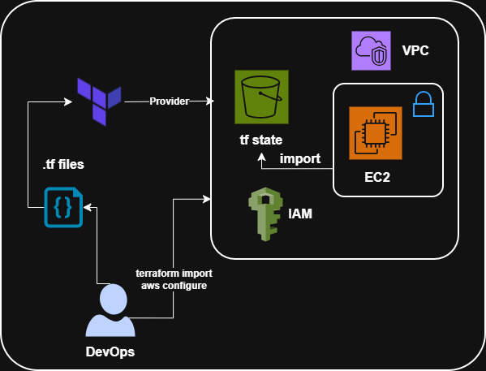

# Day 25: Importing Existing AWS Resources

## Objective

The goal of this project is to demonstrate how existing AWS resources can be imported into Terraform state and managed using Infrastructure as Code (IaC).

## Architecture Diagram


## Prerequisites

- **Terraform** installed (>= 1.0)
- **AWS CLI** configured and authenticated
- **IAM credentials** with required permissions (EC2, VPC, SecurityGroup)
- **Existing AWS VPC** and **Security Group** resources in your AWS account

## How It Works

The import workflow involves these key components:

### 1. Terraform Configuration Files (.tf)
- Define the infrastructure structure and desired state
- Reference existing AWS resources using data sources and resource blocks
- Contains variables, outputs, and resource definitions

### 2. AWS Provider Configuration
- Authenticates using IAM credentials
- Establishes connection to AWS
- Specifies the target region and account

### 3. Terraform Import Command
- Reads existing AWS resources from your account
- Imports them into Terraform state
- Updates `terraform.tfstate` to reflect real infrastructure

### 4. Terraform State File
- Maintains mapping between Terraform configuration and real AWS resources
- Tracks resource attributes and dependencies
- Enables plan and apply operations

### 5. AWS Infrastructure
- **Existing VPC** - Virtual Private Cloud
- **Security Group** - Networking rules and access controls
- **EC2 Instances** - Compute resources within the VPC

## Project Structure

```
Day-25/
├── Readme.md                    # Project documentation
├── assets/                      # Supporting files and diagrams
└── terraform/                   # Terraform configuration files
    ├── main.tf                  # Main resource definitions
    ├── vpc.tf                   # VPC and networking resources
    ├── security_group.tf        # Security group configurations
    ├── variables.tf             # Input variables
```

## Step-by-Step Implementation

### Step 1: Initialize Terraform

Initialize the Terraform working directory and download the AWS provider:

```bash
cd Day-25/terraform
terraform init
```

This command:
- Downloads the AWS provider plugin
- Creates the `.terraform/` directory
- Initializes the state file

### Step 2: Configure Variables

Set your VPC ID and other required variables in `terraform.tfvars`:

```hcl
vpc_id = "vpc-xxxxxxxx"
region = "us-east-1"
```

### Step 3: Import Existing Security Group

Import an existing security group from AWS into Terraform state:

```bash
terraform import aws_security_group.app_sg sg-0xxxxxxxxx
```

Replace `sg-0xxxxxxxxx` with your actual security group ID.

**Expected Output:**
- Terraform contacts AWS and retrieves the security group details
- Imports the resource into `terraform.tfstate`
- Updates the local state file

### Step 4: Verify the Import

Check what resources are now managed by Terraform:

```bash
terraform state list
```

View detailed information about the imported security group:

```bash
terraform state show aws_security_group.app_sg
```

### Step 5: Review and Plan

Generate an execution plan to see what Terraform will do:

```bash
terraform plan
```

This verifies that your configuration matches the imported resources.

### Step 6: Apply Changes (if needed)

Apply any configuration changes:

```bash
terraform apply
```

Use `-auto-approve` flag to skip the confirmation prompt:

```bash
terraform apply -auto-approve
```

## Key Takeaways

This project demonstrates:

- ✅ Using the AWS provider in Terraform
- ✅ Working with data sources to reference existing resources
- ✅ Importing existing AWS resources into Terraform state
- ✅ Understanding Terraform state files and management
- ✅ Managing real-world infrastructure with Infrastructure as Code

## Troubleshooting

### Error: "Cannot import non-existent remote object"

**Cause:** The security group ID doesn't exist or is in a different region/account.

**Solution:**
1. Verify the security group ID exists in AWS:
   ```bash
   aws ec2 describe-security-groups --group-ids sg-xxxxxxxxxxx --region us-east-1
   ```

2. Check your provider region in `provider.tf`

3. Verify your AWS credentials:
   ```bash
   aws sts get-caller-identity
   ```

### Error: "Variable required but not provided"

**Cause:** Missing required variables like `vpc_id`.

**Solution:**
1. Create `terraform.tfvars` with required values
2. Or provide variables via command line: `terraform plan -var="vpc_id=vpc-xxxxx"`

### State file conflicts

**Prevention:**
- Never manually edit `terraform.tfstate`
- Always use `terraform state` commands for state management
- Backup state files before major operations
- Use remote state (S3, Terraform Cloud) for team collaboration

## Conclusion

This project demonstrates how to safely transition manually created AWS infrastructure into Terraform-managed infrastructure. By using the import command, you can:

- Bring existing resources under Terraform control
- Enable version control for infrastructure
- Establish consistent management practices
- Facilitate team collaboration and repeatability

## Additional Resources

- [Terraform AWS Provider Documentation](https://registry.terraform.io/providers/hashicorp/aws/latest)
- [Terraform Import Command](https://www.terraform.io/cli/commands/import)
- [Terraform State Management](https://www.terraform.io/language/state)
