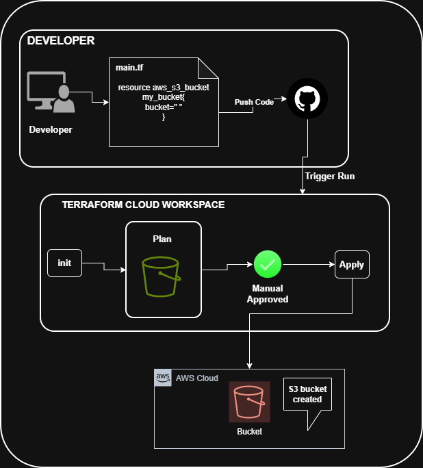

# Automated AWS S3 Provisioning using HCP Terraform

##  Problem Statement

Traditionally, infrastructure management is:
- **Manual** – Created through AWS Console
- **Decentralized** – Managed from individual laptops
- **Conflict-prone** – Multiple team members modifying infrastructure without coordination
- **Lacks governance** – No approval workflow or audit trail

This project demonstrates the transition from manual infrastructure management to a **production-grade Infrastructure as Code (IaC)** workflow using cloud-based Terraform execution.

---

##  What I Built

An automated, enterprise-ready infrastructure deployment workflow featuring:

✅ **AWS S3 bucket provisioning** using Terraform  
✅ **Cloud-based execution** via HCP Terraform  
✅ **VCS integration** with GitHub for version control  
✅ **Remote state management** with encryption and versioning  
✅ **Environment isolation** using Projects and Workspaces  
✅ **Secure credential handling** with no hardcoded secrets  

---

##  Architecture & Execution Flow



### High-Level Architecture
```
Developer → GitHub Repository → HCP Terraform → AWS Infrastructure → S3 Bucket
```

### Step-by-Step Workflow

1. **Define Infrastructure** – Write Terraform code for S3 bucket
2. **Version Control** – Push code to GitHub repository
3. **Connect VCS** – GitHub repository linked to HCP Terraform workspace
4. **Automatic Trigger** – Code push automatically initiates Terraform run in HCP Terraform
5. **Plan Stage** – HCP Terraform runs `terraform init` and `terraform plan`
6. **Review** – Generated plan reviewed in HCP Terraform UI
7. **Apply** – Upon approval, `terraform apply` executes in cloud
8. **Provision** – S3 bucket created in AWS
9. **State Management** – Terraform state securely stored in HCP Terraform (encrypted, versioned, locked)

---

##  Tech Stack & Components

### Terraform
Infrastructure as Code framework for declarative resource provisioning.

```hcl
resource "aws_s3_bucket" "mybucket" {
  bucket = var.bucket_name
}
```

### GitHub
Version control system triggering automated infrastructure changes.

### HCP Terraform (Terraform Cloud)
- Remote terraform execution environment
- Secure remote state backend
- Workspace-based environment isolation
- VCS-driven workflow automation
- Plan/apply approval system

### AWS
Cloud provider hosting the provisioned S3 resources.

---

##  Production-Ready Features

### 1. Remote State Management
**Why it matters:** Eliminates local state files and prevents conflicts

- ✅ State stored securely in HCP Terraform (encrypted, immutable)
- ✅ Automatic state locking during execution
- ✅ Complete version history of all infrastructure changes
- ✅ Zero risk of team member conflicts

### 2. VCS-Driven Automation
**Why it matters:** Removes manual execution errors

- ✅ Git push automatically triggers infrastructure changes
- ✅ No manual `terraform apply` commands needed
- ✅ Every change is version controlled and auditable
- ✅ Built-in CI/CD integration

### 3. Environment Isolation
**Why it matters:** Prevents accidental production outages

Structured using:
- **Organization** – Central management entity
- **Projects** – Logical grouping (Development, Production)
- **Workspaces** – Isolated execution environments per environment

Each workspace maintains:
- Separate Terraform state files
- Independent variables and secrets
- Complete isolation from other environments

### 4. Secure Credential Handling
**Why it matters:** Prevents credential leaks and unauthorized access

- ✅ AWS credentials stored as sensitive environment variables in HCP Terraform
- ✅ Zero secrets in code repositories
- ✅ Encrypted in transit and at rest
- ✅ Audit logs track all credential access

---

##  Key Learning Outcomes

This project demonstrates mastery of:

- How remote Terraform execution works in cloud environments
- State management best practices in team setups
- VCS-driven infrastructure automation workflows
- Proper environment isolation strategies
- Production DevOps practices used in real companies

---


##  Project Structure

```
Day-26/
├── main.tf              # S3 bucket resource definition
├── variables.tf         # Input variables (region, bucket_name, environment)
├── outputs.tf           # Output values (bucket ARN, domain name)
├── provider.tf          # AWS provider configuration
└── README.md            # This file
```

---

##  Security Highlights

- No AWS credentials in code (.gitignore protects secrets)
- Sensitive variables stored in HCP Terraform workspace
- Remote state encrypted at rest
- State locking during execution prevents race conditions
- Full audit log of all infrastructure changes

---

## 📈 Real-World Application

This exact pattern is used by companies to:
- Manage infrastructure across multiple teams safely
- Enforce separation between development and production
- Maintain compliance and audit trails
- Automate deployment pipelines
- Prevent configuration drift and manual changes

This demonstrates understanding of **enterprise infrastructure patterns**, moving beyond basic IaC into production-grade practices.

